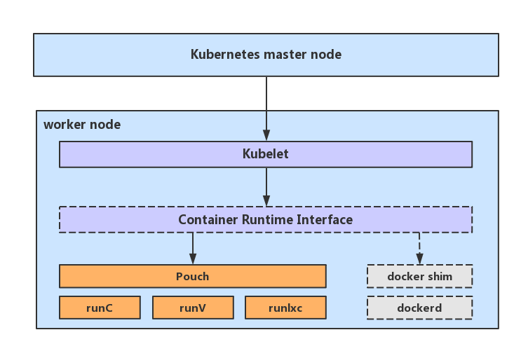

# Pouch with Kubernetes deploying

- [Pouch deploying](#pouch-with-kubernetes-deploying)
  - [Overview](#overview)
  - [Restriction](#restriction)
  - [Install and Configure](#install-and-configure)
    - [Install Pouch](#install-pouch)
    - [Install Kubelet](#install-kubelet)
    - [Setting up the master node](#setting-up-the-master-node)
    - [Setting up the worker nodes](#setting-up-the-worker-nodes)
  - [Start and run](#start-and-run)
    - [Run sandbox](#run-sandbox)

## Overview

This document shows how to easily install a Kubernetes cluster with pouch runtime.



## Restriction

Kubernetes: Kubernetes 1.6+

Pouch: master branch

Note: The rest of the restrictions are based on Pouch and Kubernetes.

## Install and Configure

### Install Pouch

You can easily setup a basic Pouch environment, see [INSTALLATION.md](../../INSTALLATION.md).

### Install Kubelet

On Ubuntu 16.04+:

```
apt-get install -y kubelet kubeadm kubectl
```

On CentOS 7:

```
yum install -y kubelet kubeadm kubectl
```

Configure kubelet with pouch runtime:

```
sed -i '2 i\Environment="KUBELET_EXTRA_ARGS=--container-runtime=remote --container-runtime-endpoint=unix:///var/run/pouchcri.sock --image-service-endpoint=unix:///var/run/pouchcri.sock"' /etc/systemd/system/kubelet.service.d/10-kubeadm.conf
systemctl daemon-reload
systemctl restart kubelet
```

For more details, please check [install kubelet](https://kubernetes.io/docs/setup/independent/install-kubeadm/#installing-kubeadm-kubelet-and-kubectl).

### Setting up the master node

For more detailed Kubernetes cluster installation, please check [Using kubeadm to Create a Cluster](https://kubernetes.io/docs/setup/independent/create-cluster-kubeadm/)

```
kubeadm init --pod-network-cidr 10.244.0.0/16 --kubernetes-version stable
```

Configure CNI network plugin

```
kubectl apply -f https://docs.projectcalico.org/v2.6/getting-started/kubernetes/installation/hosted/kubeadm/1.6/calico.yaml
```

For other plugins, please check [Installing a pod network](https://kubernetes.io/docs/setup/independent/create-cluster-kubeadm/#pod-network).

### Setting up the worker nodes

get token on master node:

```
# token=$(kubeadm token list | grep authentication,signing | awk '{print $1}')
```

join master on worker nodes:

```
# kubeadm join --token $token ${master_ip:port}
```

## Start and run

### Run sandbox

Create `pouch` Deployment(master node):

```
# cat pouch.yaml
apiVersion: apps/v1
kind: Deployment
metadata:
  name: pouch
  namespace: kube-system
  labels:
    pouch: pouch
spec:
  selector:
    matchLabels:
      pouch: pouch
  template:
    metadata:
      labels:
        pouch: pouch
    spec:
      containers:
      - name: pouch
        image: docker.io/library/busybox:latest

# kubectl create -f pouch.yaml
deployment "pouch" created
```

List sandboxes on node(worker node):

```
# crictl sandboxes
SANDBOX ID          CREATED             STATE               NAME                     NAMESPACE           ATTEMPT
e7d0384ef3cc7       48 years ago        SANDBOX_NOTREADY    pouch-75cdc5c4cb-bgzf7   kube-system         0
8370f6b54f8d8       48 years ago        SANDBOX_NOTREADY    kube-proxy-gq94v         kube-system         0
9c465807e1558       48 years ago        SANDBOX_NOTREADY    calico-node-d27rd        kube-system         0
```

## Use `Pouch CRI` in production environment

In a production environment, we recommend user to have their own CNI plugin (Flannel, Calico, Neutron etc), and persistent volume provider (GlusterFS, Cephfs, NFS etc). Please follow Kubernetes admin doc for  details about integration, and it makes no difference if you are using `pouch CRI`.


